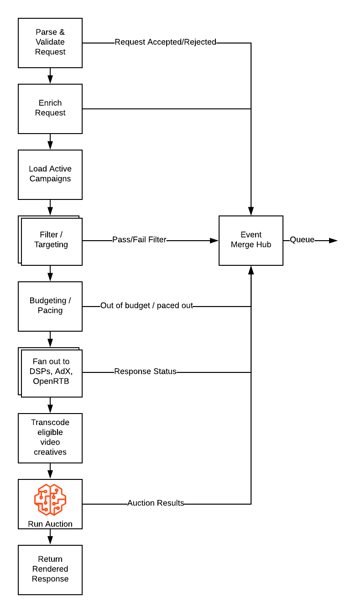
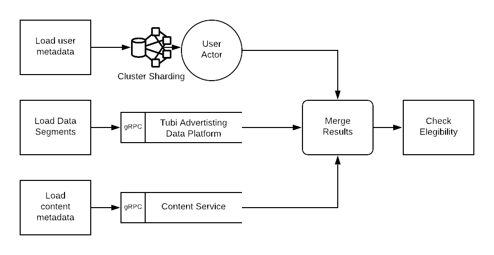
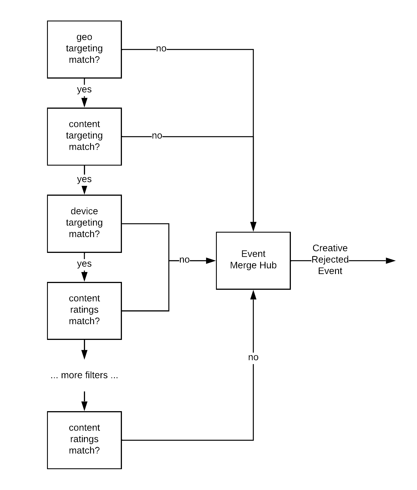

# 使用 Scala 和 Akka-Stream 打造一个彻头彻尾的响应式广告服务系统<sup>[[0](#1)]</sup>

当用户第一次发现 [Tubi](https://www.tubitv.com) 在免费提供那些品质优良、来自专业工作室制作的电影或者电视节目的时候，他们第一个问题通常都是在问：“这个合法吗？”；然后，他们第二个问题不可避免地又会问：“但是你们怎么赚钱呢？”。“参议员先生<!--或者：大哥-->，我们卖广告！”<sup>[[1](#1)]</sup> 事实上，Tubi 从诞生的那一天起，就已经在产生健康的营收，使得我们不需要依赖外部风险投资成长和运营。

这个秘密就是我们拥有我们自己的广告服务，一个从我们公司诞生之始就在跑的产品。最开始，我们的广告系统是用 PHP 写的，使用 MySQL 和 Memcached 作为后端存储。虽然这个 PHP 写的系统以外地非常稳定而且性能还不错，但是给它添加新功能就非常费劲。这个系统的架构粗旷地演进了五年，我们已经非常难理清楚它的一些内部机制是怎样工作的。更糟糕的事情是，公司里精通 PHP 的同事并没有几个了。所以，我们决定推到重写，并达到一下目标：

- 清除经年累月积累下来的技术债务
- 支持更加优越的投放控制、竞价策略
- 给我们的广告运营团队提供更好的监控和调试工具
- 提高测试的覆盖率

我们选择了 Scala 和 Akka 作为我们的技术栈。主要出于两方面的因素：通过 [Akka Stream](https://doc.akka.io/docs/akka/current/stream/index.html) 构建高吞吐量的数据分析流水线，和使用 Akka Actors 建立的低延迟机器学习服务基础设施，我们已经积累了很多关于 Akka 框架的经验；与此同时，我们也在 Spark 相关的机器学习项目上广泛地使用了 Scala 这门语言。

我们决定把整个广告业务建模为一个响应式流（[Reactive Streams](http://www.reactive-streams.org/)），把状态保存到 Actor 里面。如果你想了解我们这个选择背后的原因，就让我们先去了解一下，一个典型的广告请求是怎样工作的吧：在用户观看视频的时候，有很多候选的广告植入时间点（我们通过计算机视觉算法，在我们处理原始视频的时候就自动选定的）<!--或者：在处理原始视频的时候，我们使用了计算机视觉算法，在每个视频所有的播放帧里，自动选定了许多候选的广告插入时间点。-->。当用户播放到这些时间点的前面几秒钟，播放器会向我们的广告服务器发送请求，询问是不是要插入广告。广告服务器有小于 1 秒钟的时间去执行这个请求：决策是不是要插入广告；如果要，那么它还要执行一个多个流程的操作，才能返回需要的广告内容。

在这系列文章的第一篇，我们会着眼于从广告服务器接收到请求，到鉴别哪些广告活动组（Campaign）符合条件，这之间要发生的主要事情。在这系列文章的后续部分，我们会探究如何从每个广告活动组中获得出价信息，以及我们是怎样评判各个出价的。

## 第一步：请求的解析和校验

由于整个请求/响应的生命周期是使用流式建模的，所以我们整个广告活动组（Campaign）⇒ 订单项（Line Item）⇒ 广告素材（Creative）体系扁平化处理为一个个单独的**广告素材单元**（若把整个层级结构看作一棵树，那么我们现在以叶子结点，也就是广告素材，作为最小单元进行后续处理）。对于每个广告素材单元，他们都会在整个流上面一一被处理，一个简化后的流程图如下：



对于上图中的每个处理阶段，都有一个单独的**图**（[Graph](https://doc.akka.io/docs/akka/current/stream/stream-graphs.html)，Akka-Stream 的一种数据结构，描述一个程序流）。每个 Graph 都是可以被独立地编写、推理和测试。Akka-Stream 同时提供了一套完备的思维模型去并发推理和提供开箱即用的背压（backpressure）功能。

鉴于广告平台团队已经身处于一个 Akka 的车间里头，再使用 Akka-Http 作为我们 Web 服务的框架就显得很合情合理：请求的解析、校验，以及指标监控工具都是自带的了。在处理的第一步，我们使用 Akka 定制的路由 DSL（Routing DSL），当然也包括我们自己定制的一些 DSL，去进行全方位的请求参数校验。进行校验的这个工作为我们提供了好处，使得我们在部署生产环境前，能够在开发或者是在测试环境就发现了客户端的 Bug。

## 第二步：请求的润色

为了顺利处理每个广告请求，我们都需要调用多个服务，加载与之相关元信息。在 Tubi，我们使用 gRPC 作为服务之间调用的标准方法。在此之上，我们对每个用户都建立一个 Actor，运行在我们的 Akka 集群中，来进行元信息的管理。每个用户 Actor 保留着最近 30 天的广告观看历史，使得我们有能力对于用户观看广告的事件进行有效的频度控制：我们不会让用户淹没在没完没了的广告中，也不会让用户频繁地看同一个广告很多次。



上图展示了，我们放射式地进行异步 IO 请求，然后把请求的结果合并，最后传递给后面的独立步骤。接下来的步骤就可以判断我们是不是要向用户展示广告，如果是，要展示多少广告。每一个这样的操作，都有他们自己的**流**（[Flow](https://doc.akka.io/docs/akka/current/stream/stream-flows-and-basics.html)，Akka-Stream 的一种数据结构，是 Graph 的一种特殊形式，描述一个程序流）。在所有流被合并成为整体的图之前，每个流都可以被单独地编写和测试。

## 第三步：广告过滤和精准投放

当我们整理了所有必要的元信息，如果我们要继续处理这个广告请求，就需要先经过一系列的条件过滤和判定是否符合精准投放的需求。同理，这个流程也是使用**图**（Graph）进行建模的：每个**广告素材单元**都会在流水线上被一一判定：如果判断为不符合条件，则自动生成一个日志事件，我们会把这些日志事件保存起来，用以日后分析或者调试。



这种方法的开发效率的好处再怎么说也不为过。举个例子，一个要判断**广告素材单元**是否符合目标的视频题材的过滤器大概是长成下面这样的：

```scala
class GenresFilter extends BaseFilter("genre") {
  override def predicate: (RichContext, AdCandidate) => Boolean = {
    case (context: BaseRequestContext, ad: AdCandidate) =>
      if (ad.targeting.genreBlacklist.nonEmpty) {        !ad.targeting.genreBlacklist.exists(context.content.genres.contains)
      } else if (ad.targeting.genre.nonEmpty) {
        ad.targeting.genre.exists(context.content.genres.contains)
      } else {
        true
      }
  }
}
```

所有机械的和死板的逻辑都被包装在一个定制的**图**（Graph）里面。每个过滤器都变成了不能再简单的一个**断言函数**（Predicate function，进行逻辑判断的函数），然后可以被一个个单独地进行测试。

## 小结

本文讨论了我们是为什么着手重写我们的广告系统、我们是为什么以及怎样使用 Scala 和 Akka 作为我们新技术栈的。我们概览了如何使用**流**（Stream）来对请求/响应周期进行建模，并深入研究了其中的三个步骤。在接下来的文章中，我们会继续讨论我们广告系统的流里面剩余的几个步骤，包括：投放速度控制、出价和竞价，最后形成最终需要展示的广告。

如果您对使用 Scala 构建分布式系统充满热情，我们 Tubi 正在招聘哦！

---

- <a href="#">[0]</a> 原文[A fully reactive ad serving platform using Scala & Akka-Streams](https://code.tubitv.com/a-fully-reactive-ad-serving-platform-using-scala-akka-streams-13299e7ea04e)
- <a href="#" id="1">[1]</a> Facebook CEO 马克·扎克伯格 (Mark Zuckerberg) 在 2018 年在出席美国参议院和众议院的听证会时，回答质询的时候，回答 Facebook 免费提供服务怎么赚钱的时候的[原话](https://youtu.be/n2H8wx1aBiQ?t=37)：“Senator, we run ads!”。  


